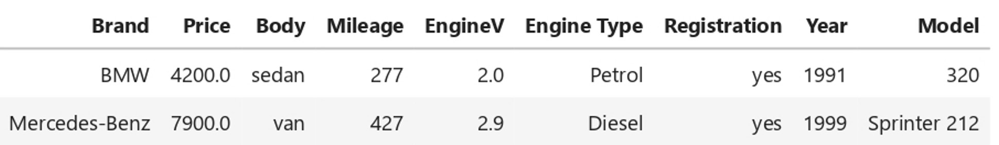
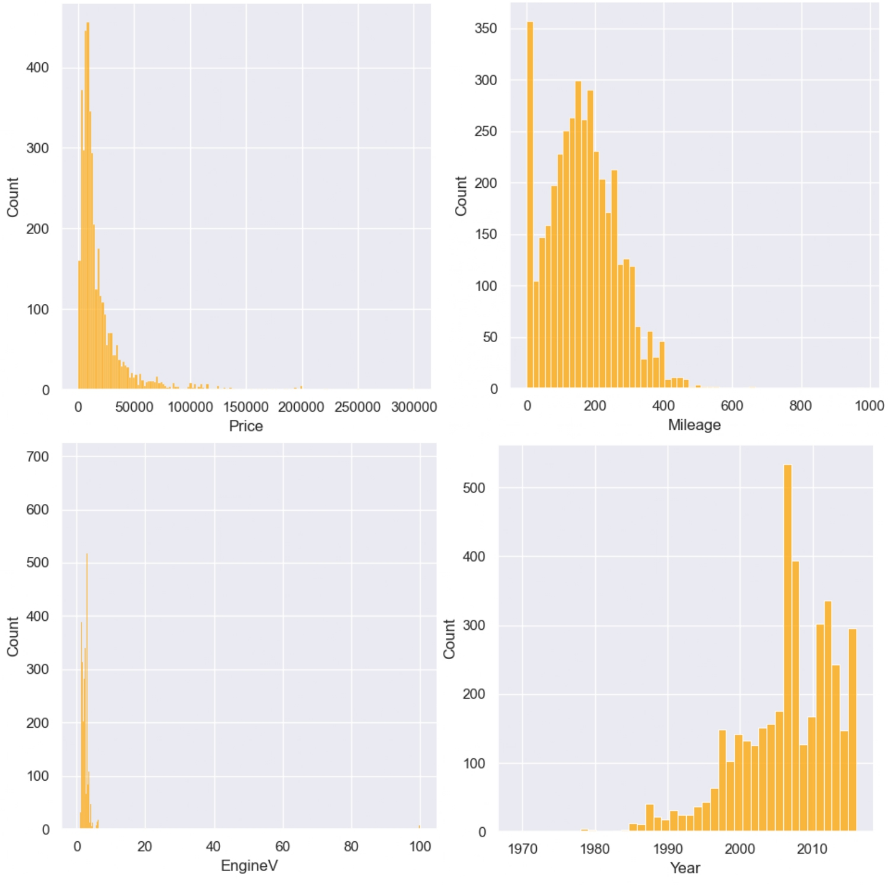
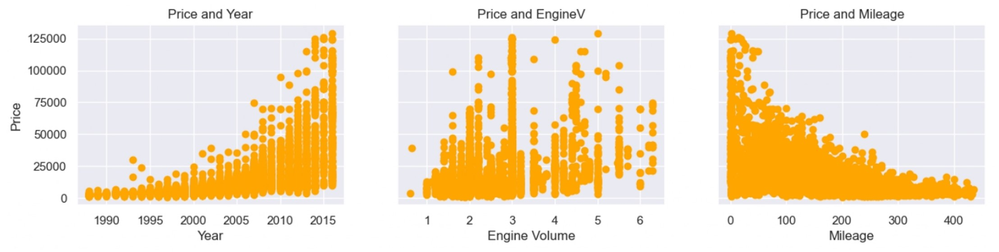
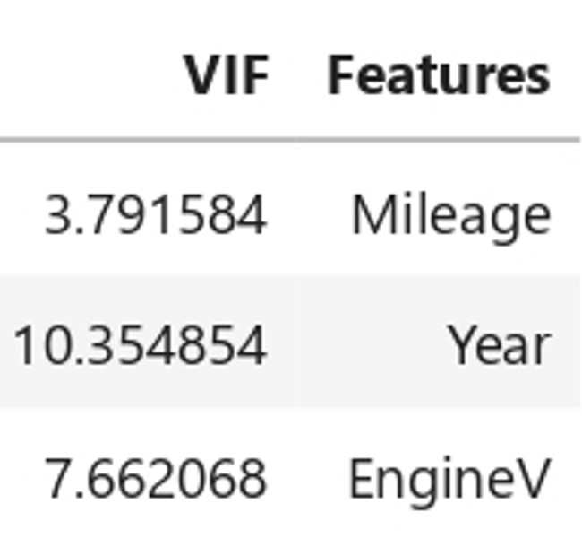
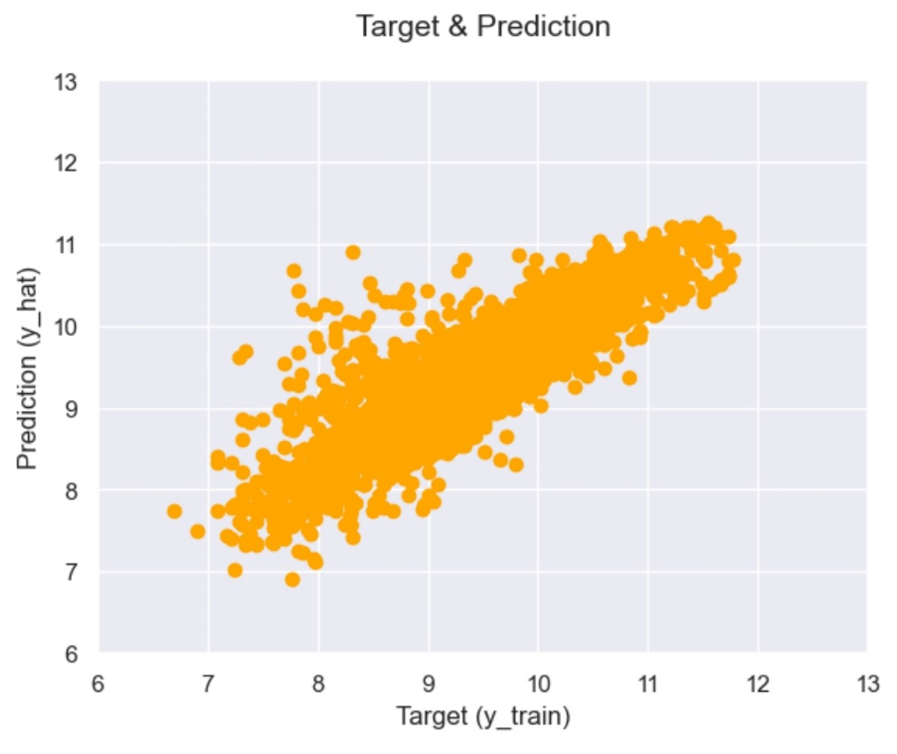
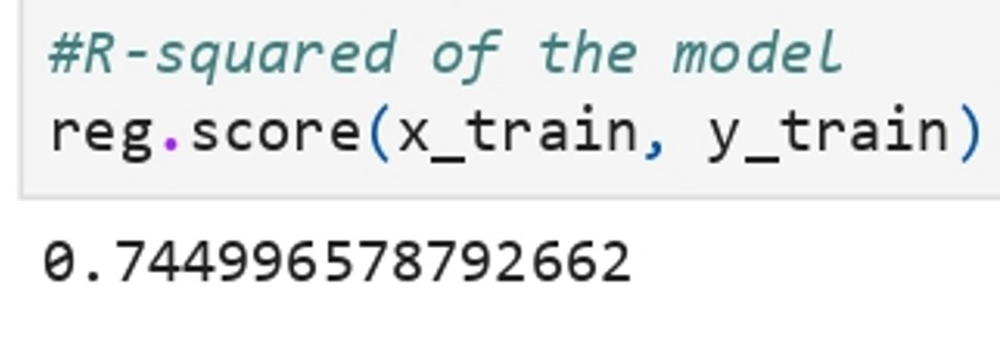
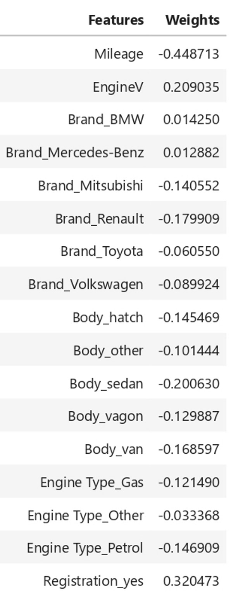

# Machine Learning Project Using Linear Regression to Predict Price of Used Car

## Project Description

**Problem :**  
Buying or selling a used car can be a complex process, and determining a fair market value for a used car is often subjective. This project addresses the challenge of predicting the price of a used car based on its specifications.

**Challenges :**  
Build a machine learning model that can predict the price of used car

## Project Goal

By leveraging machine learning techniques and historical data, the goal is to develop a model that provides accurate and reliable estimates of a used car's market value, taking into account various features and attributes.

## Tools & Library Used

 &nbsp;
 &nbsp;

## Project Result

[Click here to get full code](https://github.com/nickenshidqia/Predict_Price_of_Used_Car_Using_Linear_Regression/blob/648fc30d7b33b1878e4afb321b29416d5d5ccf30/Used%20car%20price%20prediction.ipynb)

### Dataset

    
 
- Brand ==> BMW is generally more expensive than Toyota
- Mileage ==> the more car is driven, the cheaper it should be
- EngineV ==> sports car have larger engines than economy cars
- Year of production ==> the older the car, the cheaper it is, with exception of vintage vehicles  
 
### Exploring the PDF's (Probability Density Function)  
  
  
**Price**  
- this is dataset about used car, therefore $300,000 is an excessive price
- Ouliers are great issue for OLS ==> remove top 1% of distributions !!  
 
**Engine Volume**  
- The situation with engine volume is very strange
- From google search, Car engine volumes are usually below 6.5l, so we're gonna select data below 6.5l  
  
**Mileage & Year**  
- Mileage has positive skewed distribution
- Year has negative skewed distribution
- We're gonna handling the outliers  
  
### Check linearity  
  
  
- OLS assumption of linear regression is linear, but from the plot, price is exponentially distributed
- good transformation in that case is a log transformation  
 
### Check Multicollienarity    

- Year has the highest VIF, drop 'Year'
- VIF 'Year' = 10.35 > 10 ==> unacceptable

### Linear Regression Model

- For high prices, we have a higher concentration of values around the 45 degree line ==> Our model is very good at predicting higher prices.

- Our model is explaining 75% of the variablity of the data, relatively good result

  
  
**Weights Interpretation :**  
- A positive weight shows that as a feature increases in value, so do log_price and 'Price' respectively
- Example : EngineV, the bigger the Engine volume, the higher the price
- A negative weight shows that as a feature increases in value, log_price and 'Price' decrease
- Example : Mileage, the more a car is being driven, the lower the price gets
- Dummies are compared with the benchamrk dummy
- A positive weight shows that the respective category is more expensive than the benchmark
- Example : respective category (BMV) is more expensive than the benchmark (Audi)
- A negative weight shows that the respective category is less expensive than the benchmark
- Example : respective category (Mitsubishi) is more expensive than the benchmark (Audi)
- The bigger the weights the bigger the impact
- Mileage is te most prominent feature in the regression. It is more than twice as important as Engine Volume
